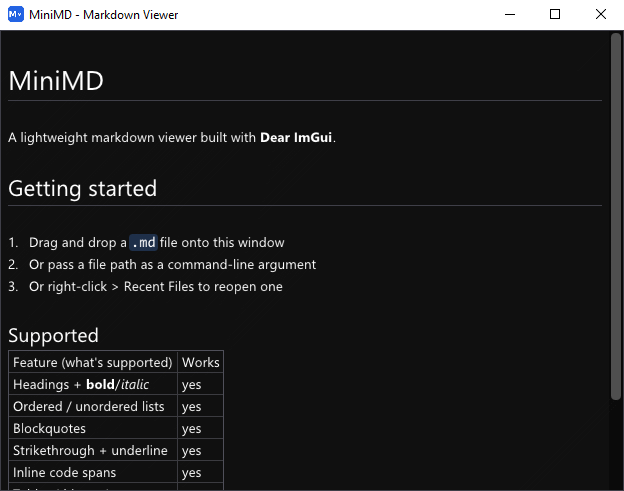

# MiniMD

A small, native markdown viewer. Dear ImGui + GLFW + OpenGL3, built with premake5. Windows is the primary target; the premake scripts and vendor build already handle Linux (X11) too, it just hasn't been exercised yet.



## Why this stack

- **GLFW + OpenGL3** - lightest, most portable windowing/renderer combo Dear ImGui supports. No platform SDK dependency, no extra runtime weight, no manual shader/pipeline setup.
- **imgui_md + MD4C** (mekhontsev/imgui_md on mity/md4c) - real CommonMark/GFM rendering (tables, lists, blockquotes, task lists, autolinks, bold/italic, strikethrough, underline, fenced code, local images), not a toy subset. MD4C parses, imgui_md turns that into ImGui draw calls.

## Layout

```
premake5.lua            workspace + configuration
premake/imgui.lua        builds vendor/imgui as a static lib
premake/glfw.lua         builds vendor/glfw as a static lib
premake/imgui_md.lua     builds vendor/imgui_md + vendor/md4c as a static lib
src/                     the app itself (MiniMD project)
vendor/                  submodules + vendored single-header libs (see vendor/README.md)
```

## First-time setup

The vendor libraries aren't committed - pull them in as submodules once you have this repo on a machine with internet access:

```
git submodule add https://github.com/ocornut/imgui.git vendor/imgui
git submodule add https://github.com/glfw/glfw.git vendor/glfw
cd vendor/glfw && git checkout 3.3.9 && cd ../..
git submodule add https://github.com/mekhontsev/imgui_md.git vendor/imgui_md
git submodule add https://github.com/mity/md4c.git vendor/md4c
git submodule update --init --recursive
```

(If the repo was cloned from somewhere that already has `.gitmodules` committed, just run `git submodule update --init --recursive` instead.)

## Building - Windows

Get `premake5.exe` (https://premake.github.io/download) onto your PATH, then from the repo root:

```
premake5 vs2022
```

Open the generated `MiniMD.sln` and build. The exe lands in `bin/<config>-windows-x86_64/MiniMD/`.

## Building - Linux (future)

```
sudo apt install libx11-dev libxrandr-dev libxinerama-dev libxcursor-dev libxi-dev
premake5 gmake2
make -j config=release
```

## Running

```
MiniMD.exe path\to\file.md
```

With no argument it shows a built-in sample. Drag-and-drop a `.md` file onto the window, or reopen one via the right-click menu's Recent Files. No menu bar or title bar beyond the OS window title, which shows "MiniMD - `<loaded path>`" (or a fallback when nothing's loaded).

## Right-click menu

No menu bar - right-click anywhere over the document for:

- **Reload** - re-reads the current file from disk. Disabled when no file is open.
- **Recent Files** - last 8 opened files, persisted to `recent.txt` in a per-user config dir (`%APPDATA%\MiniMD` on Windows, `~/.config/minimd` on Linux). "Clear Recent Files" empties it.
- **View > Zoom In / Zoom Out / Reset Zoom** - 0.5x-3.0x, also Ctrl+=/Ctrl+-/Ctrl+0.
- **Debug > (test file names)** - Debug builds only, loads a `testdata/*.md` file.
- **Options** (Windows only) - register/unregister MiniMD as a `.md` "Open with" handler (`HKCU\Software\Classes`, no admin rights needed).
- **Help > About** - author/tool summary and third-party attributions, with links.
- **Help > Check for Updates** - opens the GitHub releases page. No version check, just a shortcut.
- **Exit** - quits the app.

Copying the current selection's raw markdown source is Ctrl+C (no menu item needed).

## Known limitations / next steps

- No native "Open File" dialog or path-entry box - open by drag/drop, argv[1], or Recent Files.
- No remote image loading - only local files resolve; `http(s)://` image refs are silently skipped.
- Table columns aren't alignment-aware - `:--`/`--:` markers in the source don't affect layout.
- GLFW premake script targets the pre-3.4 source layout (tag `3.3.9`); bumping past that needs `premake/glfw.lua` updated for the new platform-abstraction sources.
- Text selection has no select-all and doesn't auto-scroll past the top/bottom edge; selecting across a table follows draw order, which can look odd for a whole multi-column table.

### Local patches to vendor/imgui_md

`vendor/imgui_md` isn't pristine upstream. Changes prefer overriding an existing (or newly added) `protected virtual` hook from `MarkdownView`/`AboutView` over hand-editing the vendored `.cpp`. Committed inside the submodule itself:

1. **Compile fix** - `get_image()`'s default assigns `ImFontAtlas::TexID` (now `ImTextureRef` since imgui 1.92) straight into an `ImTextureID` field. Fixed to `nfo.texture_id = ImGui::GetIO().Fonts->TexID.GetTexID();`.
2. **`get_table_wrap_width()` hook** - real auto-fit table columns. Upstream sizes columns off the header row alone, squishing body content; `MarkdownView` overrides `BLOCK_TABLE`/`BLOCK_TR`/`BLOCK_TD` with real `ImGui::BeginTable`/`SizingFixedFit`, and this new hook gives `render_text()`'s word-wrap a fixed per-cell width to target instead of circularly wrapping to a still-settling column.
3. **`text_run()` hook** - click-drag text selection. Records each wrapped chunk's `[str,str_end)` span (points into the original buffer) plus its on-screen rect, per frame - used for hit-testing clicks to byte offsets and slicing Ctrl+C copies straight out of the source text. Also paints the selection highlight.
4. **`render_task_checkbox()` hook** - task list items (`- [ ]`/`- [x]`). `BLOCK_LI()` got a small patch to call this instead of the usual bullet; `MarkdownView` draws the checkbox via `ImDrawList` rather than relying on a font glyph.
5. **`m_md` made `protected`** - lets `MarkdownView`'s constructor OR in `MD_FLAG_TASKLISTS`/`MD_FLAG_PERMISSIVEAUTOLINKS` after base construction, since a virtual hook can't reach the base class's own constructor.
6. **Blockquote rendering** - `BLOCK_QUOTE` was an empty stub. Now indents, dims the text, and draws a per-nesting-level left bar spanning the quote's height.
